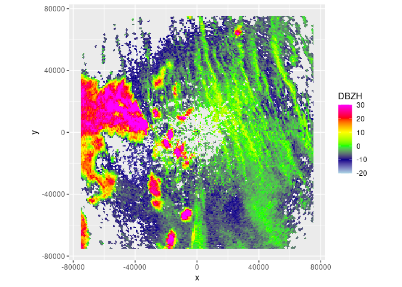
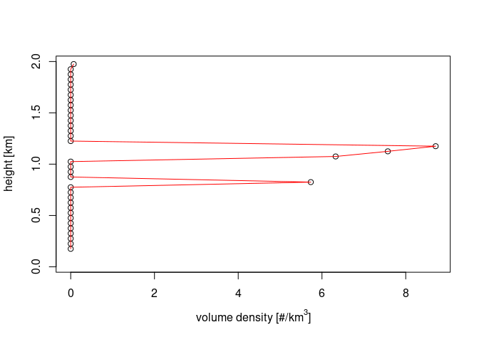
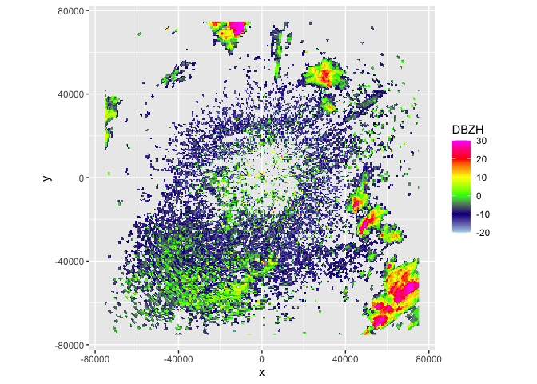
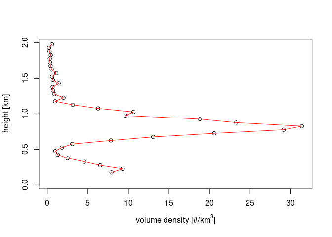
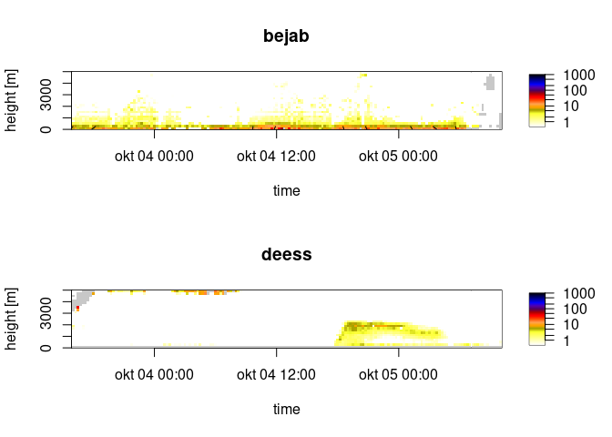

# getRad

getRad is an R package that provides a unified interface to download
radar data for biological and aeroecological research. It gives access
to both polar volume radar data and [vertical profile
data](https://aloftdata.eu/vpts-csv/) from [different
sources](https://aloftdata.github.io/getRad/articles/supported_sources.html)
and loads it directly into R. getRad also facilitates further
exploration of the data by other tools such as
[bioRad](https://adriaandokter.com/bioRad/) by standardizing the data.

## Installation

Install the released version of getRad from CRAN:

``` r

install.packages("getRad")
```

Or install the development version from [GitHub](https://github.com/)
with:

``` r

# install.packages("pak")
pak::pak("aloftdata/getRad")
```

## Usage

Download a polar volume, and then plot it using `bioRad`:

``` r

library(getRad)
library(bioRad)

# Plot daytime insect movements in Finland (Mäkinen et al. 2022)
pvol <- get_pvol("fianj", as.POSIXct("2012-05-17 14:00", tz = "UTC"))
plot(project_as_ppi(get_scan(pvol, 0), range_max = 75000))
```



``` r

plot(calculate_vp(pvol, h_layer = 50, n_layer = 40, warning = FALSE))
```



``` r


# Plot nocturnal migration in Finland
pvol <- get_pvol("fianj", as.POSIXct("2012-05-11 23:00", tz = "UTC"))
plot(project_as_ppi(get_scan(pvol, 0), range_max = 75000))
```



``` r

plot(calculate_vp(pvol, h_layer = 50, n_layer = 40, warning = FALSE))
```



Download a vertical profile time series from the [Aloft
bucket](https://aloftdata.eu/browse/):

``` r

# Plot VPTS data for two radars
vpts_list <- get_vpts(
  radar = c("bejab", "deess"),
  datetime = lubridate::interval(
    lubridate::as_datetime("2021-10-03 16:00:00"),
    lubridate::as_datetime("2021-10-05 10:00:00")
  ),
  source = "baltrad"
)
par(mfrow = 2:1)
for (i in names(vpts_list)) {
  plot(regularize_vpts(vpts_list[[i]]), main = i)
}
```



## Meta

- We welcome
  [contributions](https://aloftdata.github.io/getRad/CONTRIBUTING.md)
  including bug reports.
- License: MIT
- Get citation information for getRad in R with `citation("getRad")`.
- Please note that this project is released with a [Contributor Code of
  Conduct](https://aloftdata.github.io/getRad/CODE_OF_CONDUCT.md). By
  participating in this project you agree to abide by its terms.
